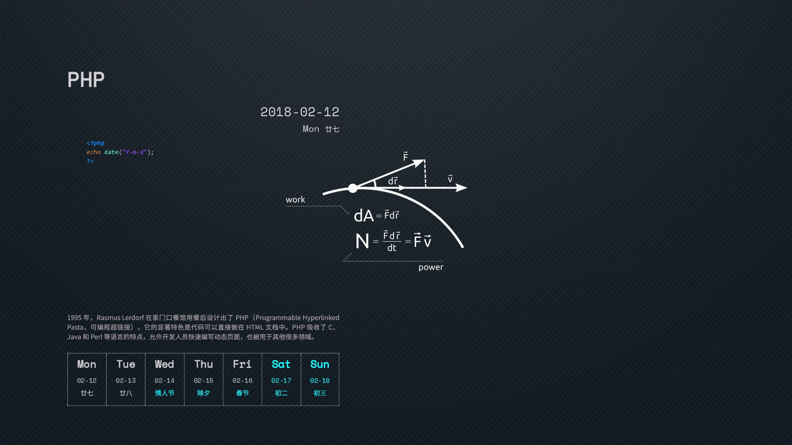

# 2018_code_calendar_wallpaper_MAC_WINDOWS
PHP实现的2018编程日历壁纸（mac和windows）

### 效果图：

### 依赖

- php环境
- Imagick扩展
- 自行谷歌百度安装好php环境和Imagick扩展

### 使用:
- 下载项目，进入项目地址，进入code目录下,修改配置config.php,配置当前操作系统（'MAC','WINDOWS'）
- CMD或者终端，执行`php wallpaperScript.php`即可实现生成并且设置壁纸，
- 如果你想使用自己的壁纸，可以将项目source目录下的`paper.jpg`换成你的壁纸。

### 参考资源:

1. [ttttmr](https://github.com/ttttmr/2018_code_calendar_wallpaper/commits?author=ttttmr)的[2018编程日历壁纸](https://github.com/ttttmr/2018_code_calendar_wallpaper)
2. [极客编程日历2018桌面壁纸](https://www.jianshu.com/p/912ce01d4752)
3. [RayZhao1998](https://github.com/RayZhao1998)的[2018_code_calendar_wallpaper_MacOS](https://github.com/github-perfei/2018_code_calendar_wallpaper_MacOS)